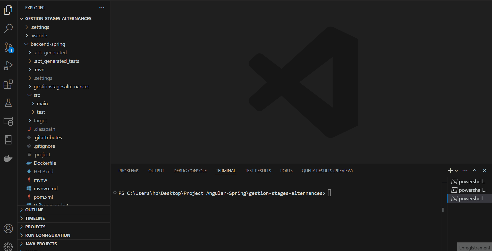
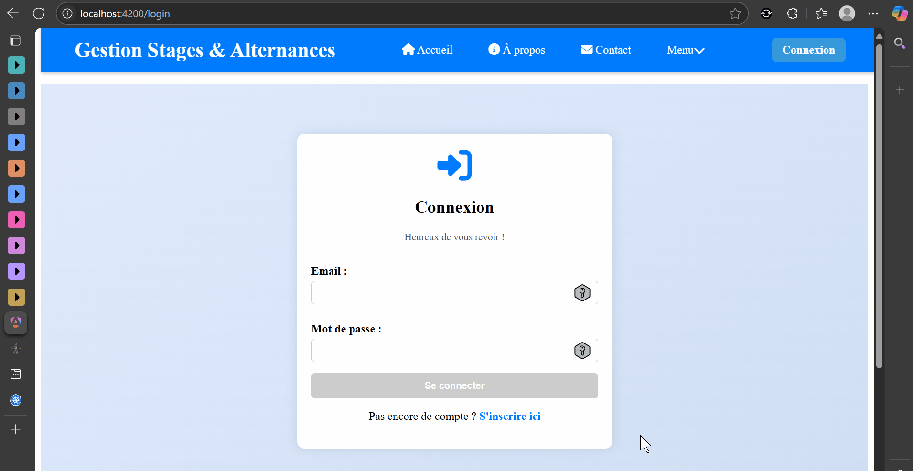
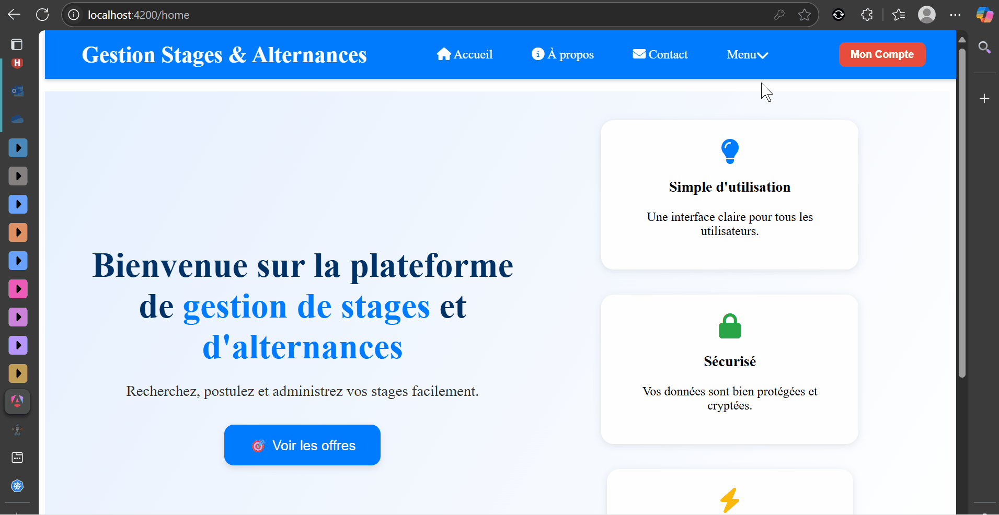

# 🎓 Gestion de Stages et Alternances

Bienvenue dans le projet **Gestion de Stages et Alternances**, une application Web fullstack Angular + Spring Boot permettant la gestion des offres de stages/alternances, des candidatures, des entreprises, des étudiants et des utilisateurs (admins compris).

Aperçu de l'application : 



---

## 🚀 Fonctionnalités principales

### 🏢 Entreprises
- Création de compte
- Publication et gestion des offres de stage / alternance
- Consultation des candidatures reçues

### 🎓 Étudiants
- Inscription
- Navigation parmi les offres
- Postulation avec CV et lettre de motivation

### 🔒 Administrateurs
- Gestion des comptes utilisateurs (entreprises, étudiants, admins)
- Modération des offres et des candidatures

---

## 📁 Architecture du projet

```
gestion-stages-alternances/
│
├── backend-spring         → API REST Spring Boot
├── frontend-angular        → UI Angular Standalone
└── docker-compose.yml     → Orchestration Docker multi-conteneurs
```

---

## 👨‍💼 Technologies utilisées

### 🔧 Backend – Java / Spring Boot
- Spring Boot 3
- Spring Data JPA + PostgreSQL
- Spring Web REST
- Lombok
- Sécurité Spring (désactivée temporairement)

### 🎨 Frontend – Angular 17+
- Standalone Components
- Angular Router
- Reactive Forms
- Pipes personnalisés
- CSS personnalisée

---

## ⚡ Installation manuelle (sans conteneur)

### 1. Cloner le dépôt
```bash
git clone https://github.com/Teddy-Aimerick-TCHINDA-TAKUETE/gestion-stages-alternances.git
```

### 2. Lancer le backend
```bash
cd backend-spring
./mvnw spring-boot:run
```

### 3. Lancer le frontend
```bash
cd frontend-angular
npm install
ng serve
```

---

## 🐳 Conteneurisation avec Docker

L'application peut être lancée avec **Docker** via `docker-compose`.

### 📦 Étapes
```bash
# À la racine du projet
docker-compose up --build
```

### 📦 Ce que fait docker-compose :
- Lance PostgreSQL avec un volume persistant
- Build et lance le backend Spring Boot dans un conteneur Java
- Build et déploie le frontend Angular avec Nginx
- Met les services en réseau via `bridge`

### Accès :
- 🔗 Frontend : [http://localhost:4200](http://localhost:4200)
- 🔗 Backend : [http://localhost:8080](http://localhost:8080)

---

## ☸️ Kubernetes (bientôt)

Une orchestration Kubernetes est prévue avec :
- Déploiement des pods (`Deployment`)
- Services (`ClusterIP`, `LoadBalancer`)
- ConfigMap / Secrets pour les variables sensibles
- Volume persistant PostgreSQL via `PersistentVolumeClaim`

🛠️ Fichiers `k8s/` à venir avec :
```
k8s/
├── backend-deployment.yaml
├── frontend-deployment.yaml
├── postgres-deployment.yaml
└── ingress.yaml
```

Aperçu du dashboard kubernete : 


---

## 🎥 Démonstration

Aperçu de l'application : 


Aperçu de l'inscription : 



Aperçu du role superadmin : 



Aperçu du role admin : 


Aperçu du role entreprise : 


Aperçu du role etudiant : 


---

## 📊 Évolutions prévues

- 🔐 Authentification par JWT
- 🔎 Recherche et pagination
- 📧 Notifications email (via Mailtrap / SMTP)
- 🧾 Export CSV des candidatures

---

## 👤 Auteur

Projet réalisé par **Teddy Aimerick TCHINDA TAKUETE**

> _"Concentration, rigueur et passion font les meilleurs projets."_

---

## 🔗 Liens utiles

- [Angular](https://angular.io)
- [Spring Boot](https://spring.io/projects/spring-boot)
- [Docker](https://www.docker.com/)
- [Kubernetes](https://kubernetes.io/)
- [GitHub - Teddy](https://github.com/Teddy-Aimerick-TCHINDA-TAKUETE)

---

## 📚 Licence

Ce projet est sous licence **MIT** — libre de l’utiliser, le modifier et le distribuer.
